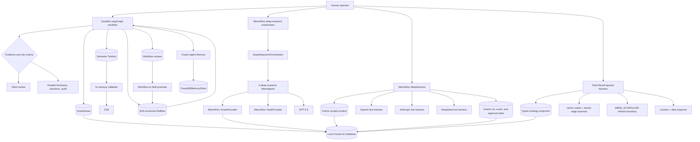

# Part 1 advanced — durable, researching, and meta-harnesses

This track implements the two workshops in O'Reilly's
[Advanced Harness Engineering](https://www.oreilly.com/live-events/advanced-harness-engineering/0642572381288/)
outline and adds a third MemoRizz MetaHarness lab. It is a continuation of the Part 1
fundamentals, not a replacement for them. The Total Recall notebook builds its
complete harness in visible cells; its layered appbook adds ontology/GraphRAG plus
the shared context-window and data-inspection experience.

| Section | Notebook | Appbook | Core proof |
|---|---|---|---|
| Durable workflow | [`advanced_durable_workflow.ipynb`](workflow/notebook/advanced_durable_workflow.ipynb) | [`workflow/appbook`](workflow/appbook/) | Define seven tools and their database registrations directly in cells; compile a 17-node graph with missing-evidence, short-review, and parallel high-risk trajectories; approve, verify, and promote a repeated successful workflow into a new Skill |
| MemoRizz deep research | [`advanced_deep_research.ipynb`](deep_research/notebook/advanced_deep_research.ipynb) | [`deep_research/appbook`](deep_research/appbook/) | Build the live application entirely in notebook cells: six GPT-5.5 deep-research MemAgents, Oracle-only private/shared memory, real OpenAI embeddings, audited Tavily retrieval, least-privilege E2B execution, evidence curation, semantic recall, and host review |
| MemoRizz MetaHarness | [`advanced_metaharness.ipynb`](metaharness/notebook/advanced_metaharness.ipynb) | [`metaharness/appbook`](metaharness/appbook/) | Triage live Oracle run/event evidence through an Oracle-only outer loop, route to OpenAI, Anthropic, or optional DeepSeek, inspect exact context, and persist normalized events |
| Fair harness evaluation | [`advanced_fair_harness_evaluation.ipynb`](metaharness/notebook/advanced_fair_harness_evaluation.ipynb) | Separate notebook | Study experimental design separately from the live MetaHarness walkthrough |
| Total Recall | [`advanced_total_recall_ontology.ipynb`](total_recall/notebook/advanced_total_recall_ontology.ipynb) | [`total_recall/appbook`](total_recall/appbook/) | Build a self-contained 198-cell harness with Oracle memory/embeddings, GPT-5.5 Responses, semantic Toolbox/Skillbox, workflow promotion, context engineering, durable execution, and a ten-layer interactive appbook |

## Architecture



`OracleSaver`, Oracle Agent Memory, and the typed semantic catalogs have separate roles
in the from-scratch durable workflow. The saver checkpoints control flow; OAM stores
operational facts through `OracleDBMemoryStore`; and the Toolbox, Skillbox, and
workflow-recipe tables hold retrievable harness capabilities. The notebook defines
these compositions and every route function directly in cells. Tool callables remain
in Python, while their model-facing interfaces live in Oracle. Canonical procedures
are real `SKILL.md` documents, retrieved first as a small manifest and loaded in full
only when selected. Deep research deliberately uses a different path:
MemoRizz's `OracleProvider` supplies every private and shared memory scope while
`DeepResearchOrchestrator` coordinates `ApplicationMode.DEEP_RESEARCH` MemAgents. The
notebook has no offline research mode: the ordinary offline test run compiles its code
cells, while a live run requires Oracle, OpenAI, Tavily, E2B, and explicit operator
confirmation.

## Install only published packages

Use Python 3.11 or newer. The pinned environment currently resolves MemoRizz 0.6.3
with its published `sandbox-e2b` extra, LangGraph 1.2.11,
`langgraph-oracledb` 1.0.1, Oracle Agent Memory 26.6.0, Tavily 0.7.27, the OpenAI
Python client, and the Anthropic 1.0.0 client from PyPI.

```bash
python3.12 -m venv .venv
.venv/bin/python -m pip install --upgrade "memorizz[sandbox-e2b]"
.venv/bin/python -m pip install --upgrade -r part_1/advanced/requirements.txt
```

No advanced module imports the local MemoRizz checkout, uses an editable MemoRizz
install, or inserts an external `src` directory into `PYTHONPATH`. That checkout
informed curriculum design only. The provenance cell in the MetaHarness notebook
asserts that `memorizz.__file__` resolves inside `site-packages`.

## Configure the local Oracle AI Database

The live path expects an existing local Oracle AI Database 23ai-or-newer service and a
course user that can create the LangGraph tables and vector indexes. The 26ai service
used elsewhere in this repository is appropriate. Put local database settings in the
ignored root `.env` or export them in the launch shell:

```dotenv
ADVANCED_BACKEND=oracle
ADVANCED_RESEARCH_MEMORY_BACKEND=oracle
ADVANCED_ORA_DSN=127.0.0.1:1523/FREEPDB1
ADVANCED_ORA_USER=AGENT
ADVANCED_ORA_PASSWORD=replace-with-local-password
ADVANCED_SEMANTIC_BACKEND=openai
ADVANCED_AGENT_MEMORY_SEARCH_STRATEGY=vector
ADVANCED_NOTEBOOK_LIVE=1
ADVANCED_USE_MODEL_SYNTHESIS=true
ADVANCED_OPENAI_MODEL=gpt-5.5
ADVANCED_ANTHROPIC_MODEL=claude-opus-5
ADVANCED_DEEPSEEK_MODEL=deepseek-v4-flash
E2B_API_KEY=replace-at-runtime
ADVANCED_SANDBOX_LIVE=1
```

The setup calls for both persistence objects are idempotent. Oracle configuration and
credentials are never returned by an API response; status surfaces expose only the DSN,
user, backend, Oracle version, and boolean readiness flags.

The semantic catalogs request Oracle HNSW cosine indexes. If a small local container
cannot allocate enough vector-memory pool (`ORA-51962`), the catalog reports that
condition and uses exact Oracle cosine distance instead. Retrieval remains semantic;
only the approximate-index acceleration is absent.

The MetaHarness lesson uses live OpenAI embeddings with Oracle VECTOR storage and
search. It does not require permission to install an ONNX model in the database.

Use the host port actually published by Docker (`docker port
erpa-custom-oracle-26ai 1521`). On the validated local machine that port is `1523`.
If `AGENT` is missing, locked, or its password no longer matches the ignored `.env`,
the local-only provisioner creates or updates that one course account in `FREEPDB1`
and verifies a host connection:

```bash
.venv/bin/python part_1/advanced/scripts/provision_oracle_course_user.py
```

The ontology refresh works through its stored procedure without extra privilege. To
install the recurring DBMS_SCHEDULER job as well, explicitly opt into the schema-local
`CREATE JOB` grant (never `CREATE ANY JOB`):

```bash
.venv/bin/python part_1/advanced/scripts/provision_oracle_course_user.py --enable-scheduler
```

That is a persistent database-security change. Review it with the database owner
before running it; the app reports the direct-procedure fallback until then.

It reads `ORA_AGENT_PWD`/`ADVANCED_ORA_PASSWORD` at runtime, sends DDL to SQL*Plus over
stdin, and never places the password in process arguments or command output. The
provided Oracle image uses the `ERPA_DATA` tablespace; both the PDB and tablespace are
explicit command options for a differently provisioned local image.

## Secrets and paid calls

The research notebook uses `getpass` for Tavily, OpenAI, Anthropic, and the Oracle
application-user password. The workflow notebook first reuses
`ORA_AGENT_PWD`/`ADVANCED_ORA_PASSWORD` from ignored runtime configuration and prompts
only if neither exists. It requests OpenAI when semantic/model behavior is active and
E2B when `ADVANCED_SANDBOX_LIVE=1`. The MetaHarness notebook reads Oracle and provider
credentials from the ignored course `.env`: `OPENAI_API_KEY` supplies live embeddings
and the OpenAI harness, while `ANTHROPIC_API_KEY` and `DEEPSEEK_API_KEY` optionally
enable the Anthropic and DeepSeek harnesses. It does not use E2B. The fair-evaluation notebook requests provider keys only
when its separate paid profile is enabled. Hidden values are never printed, written
into notebook output, or returned by an appbook API.

Every tool selected by the workflow crosses the same notebook-defined sandbox function. The harness
validates JSON arguments, creates a fresh sandbox, forwards an empty environment,
enforces a timeout, captures input/execution/output digests, recomputes the result on
the host, and closes the sandbox in `finally`. The E2B provider disables sandbox
egress; the local-process provider is explicitly labelled as a test profile and never
claims remote isolation. The separate human gate protects publication, not routine
read-only analysis tools.

The live MetaHarness query path is pre-authorized for three fixed, read-only provider
routes. New authority—such as arbitrary endpoints, secret forwarding, governed tools,
or workspace writes—should pause through the Oracle-backed approval store. The
separate fair-evaluation notebook owns comparison methodology and does not appear in
the live execution appbook.

## Run the notebooks

```bash
.venv/bin/python -m jupyter lab part_1/advanced
```

Every code block has a preceding explanation and each of the five notebooks includes
multiple Mermaid views of topology, state, memory, failure, and approval flow. Start
with the workflow, continue to deep research and MetaHarness, study the evaluation
capstone, then use Total Recall to build memory, retrieval, semantic catalogs, tools,
skills, automations, and context management from the database upward.

To execute and persist the workflow with live local Oracle while retaining the
no-model/no-E2B profile:

```bash
.venv/bin/python part_1/advanced/scripts/execute_notebooks.py \
  --profile live-oracle-workflow \
  --notebook advanced_durable_workflow.ipynb

.venv/bin/python part_1/advanced/scripts/execute_notebooks.py \
  --profile live-oracle-total-recall \
  --notebook advanced_total_recall_ontology.ipynb

.venv/bin/python part_1/advanced/scripts/execute_notebooks.py \
  --profile live-metaharness \
  --notebook advanced_metaharness.ipynb \
  --harness both \
  --confirm-live-metaharness \
  --timeout 600
```

`--confirm-live-metaharness` acknowledges both provider charges and that the
minimized Oracle incident fields printed in Section 6 may enter the selected
provider's context. Original user text and thread/memory identifiers are excluded.

The Total Recall command also requires the 384-dimensional
`ALL_MINILM_L12_V2` ONNX model in Oracle, `ORA_AGENT_PWD` (or
`ADVANCED_ORA_PASSWORD`), and a valid `OPENAI_API_KEY` with `gpt-5.5` access.
Without those live prerequisites, the offline profile performs an honest 88-cell
source compilation only.

## Run the appbooks

Each appbook serves its frontend and API from one FastAPI process:

```bash
part_1/advanced/workflow/appbook/run.sh       # http://127.0.0.1:8010
part_1/advanced/deep_research/appbook/run.sh  # http://127.0.0.1:8011
part_1/advanced/metaharness/appbook/run.sh    # http://127.0.0.1:8012
part_1/advanced/total_recall/appbook/run.sh   # http://127.0.0.1:8013
```

The workflow surface first displays the notebook's 17-node, three-trajectory supplier
decision map. Its live 18-node operational extension runs the Northstar full-review
outcome with added memory recall, model planning, crash recovery, recipe capture, and
promotion. Live node and edge states come from the persisted graph snapshot, while its
trace maps Oracle Agent Memory events back to their nodes. Separate panels expose the
retrieved Skill manifest, full loaded Skill documents, ranked and bound tools, each
sandbox input/execution/output envelope, and workflow-to-Skill promotion evidence. The
workflow AppBook forces Oracle persistence and does not expose an in-memory runtime
profile.

The Total Recall surface presents ten connected layers, including the compiled loop,
complete business ontology, semantic seeds, stored paths, citations, context window,
read-only data explorer, scheduler boundary, and workflow-promotion state.

For the MetaHarness appbook, configure Oracle plus `OPENAI_API_KEY`; add
`ANTHROPIC_API_KEY` or `DEEPSEEK_API_KEY` to expose the optional live harnesses. The nested execution map follows
the Oracle event stream while a query runs, and each node opens a modal showing its
bounded context and host evidence. Keys never enter browser storage or API responses.
This is a localhost teaching app; a deployment must add authenticated users,
authorization, rate limits, and an explicit data-retention policy.

## Verify

The acceptance suite checks the advanced materials without sending paid requests.
Other lessons retain clearly labelled local test paths; the MetaHarness lesson itself
is checked structurally and has only its live Oracle/provider application path:

```bash
.venv/bin/python -m pytest -q part_1/advanced/tests
```

With Oracle configured, prove process-level recovery rather than object-level resume:

```bash
ADVANCED_SEMANTIC_BACKEND=hash .venv/bin/python part_1/advanced/scripts/oracle_preflight.py
ADVANCED_SEMANTIC_BACKEND=hash .venv/bin/python part_1/advanced/scripts/workflow_restart_proof.py
```

If a configured Tavily key is rejected, validate a rotated replacement without saving
it or placing it in shell history:

```bash
.venv/bin/python part_1/advanced/scripts/tavily_preflight.py --prompt
```

That command launches three fresh Python processes for crash, resume, and approval.
All three must report `backend=oracle`, and the middle process must report that the
committed draft was reused.

See [`INSTRUCTOR_RUNBOOK.md`](INSTRUCTOR_RUNBOOK.md) for the teaching sequence,
discussion prompts, and live-service boundaries. The acceptance suite and preflight
commands above provide the reproducible checks for the published materials.

## Primary technical references

- [Oracle LangGraph integration guide](https://docs.oracle.com/en/database/oracle/oracle-database/26/aintg/langgraph-oracledb-integration-guide/langgraph-python.html)
- [Oracle Agent Memory 26.6 API](https://docs.oracle.com/en/database/oracle/agent-memory/26.6/guide/api/index.html)
- [LangGraph OracleDB on PyPI](https://pypi.org/project/langgraph-oracledb/)
- [Tavily Python SDK](https://github.com/tavily-ai/tavily-python)
- [GPT-5.5 model reference](https://developers.openai.com/api/docs/models/gpt-5.5)
- [Claude Opus 5 model reference](https://platform.claude.com/docs/en/about-claude/models/whats-new-opus-5)
- [MemoRizz on PyPI](https://pypi.org/project/memorizz/)
- [E2B Python sandbox reference](https://e2b.dev/docs/sdk-reference/code-interpreter-python-sdk/v1.0.5/sandbox)
- [LangGraph persistence and pending writes](https://docs.langchain.com/oss/python/langgraph/persistence)
- [Oracle ontology support](https://docs.oracle.com/en/database/oracle/oracle-database/26/rdfrm/ontologies.html#GUID-3BAE05B2-16B5-46A2-8223-EC01BB752BA1)
- [Oracle on deep business semantics](https://blogs.oracle.com/ai-data-platform/why-enterprise-ai-needs-deep-business-semantics)
