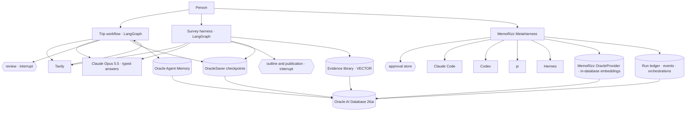

# Part 2 advanced: workflow, deep research, and a meta-harness

Part 1's advanced track set out three modes an agentic application can run in. Part 2
builds each of them again around its own use cases, on Oracle AI Database, Claude Opus 5.5
and real web search, and adds a reading of MemoRizz's meta-harness from its source.

| Mode | Use case | Notebook | Appbook | Live proof |
|---|---|---|---|---|
| **Workflow**: the steps are known before the run | Book a trip: flight, hotel and car from real web searches, one itinerary, approval, a booking saga, compensation, crash recovery | [`workflow/notebook/`](workflow/notebook/) | [`workflow/appbook/`](workflow/appbook/) · port 8040 | Two processes: the first is killed inside `book_flight`; the second continues and the flight is replayed, not booked twice |
| **Deep research**: the steps are decided as it runs | Write a survey-like paper on a subject: scholarly search, an evidence library by meaning, typed reading, a framework, sections in parallel, a referee pass, two approvals | [`deep_research/notebook/`](deep_research/notebook/) | [`deep_research/appbook/`](deep_research/appbook/) · port 8041 | A 16,000-word survey on agent harness engineering with 94 references, every one a page the harness read: [`deep_research/samples/`](deep_research/samples/) |
| **Meta-harness**: one host, many agents | The trip ledger has a defect; pi plans, Codex implements behind an approval, Claude Code reviews; a comparison puts one question to two agents | [`metaharness/notebook/`](metaharness/notebook/) | notebook only | MemoRizz read from its source and run live, with memory, the run ledger and approvals in Oracle AI Database |

## Architecture



The two harnesses share one shape: a typed state, plain node functions, checkpoints in
Oracle through `OracleSaver`, `interrupt()` where a person decides, and a JSON schema on
every model call so the harness never parses prose. They differ in what the graph
decides at run time: the workflow's fan-out is fixed and its saga runs in order; the
research graph makes one `gather` and one `write` task per section with `Send`, and its
review can send the run back to gather once.

## Set up

```bash
python3.12 -m venv part_2/advanced/.venv
part_2/advanced/.venv/bin/python -m pip install -r part_2/advanced/requirements.txt
```

The appbooks' `run.sh` use `part_2/advanced/.venv` when it exists, and fall back to
`part_2/custom_harness/.venv`, which has the same packages.

**Oracle AI Database.** The Part 2 custom-harness notebook starts Oracle AI Database Free
in Docker as `ppa-custom-oracle-26ai` on port 1524. The advanced track uses the same
database and creates its own schema, `PPA_ADVANCED`, through the container's
operating-system authentication: `sqlplus / as sysdba` inside the container needs no
password. When the database is not in Docker on the machine, set `ORACLE_ADMIN_PASSWORD`.
The ONNX sentence embedder is loaded into the schema once, so every embedding in this
track is computed inside the database.

**Keys.** `ANTHROPIC_API_KEY` and `TAVILY_API_KEY`, in the shell or the repository `.env`.
The meta-harness notebook also uses Codex's own login, and pi and Hermes from
`part_2/harness_done_for_you/.tools` when they are there.

## Run the notebooks

```bash
part_2/advanced/.venv/bin/python -m jupyter lab part_2/advanced
```

Each notebook stands alone, is segmented by parts for the outline, and marks the parts to
show live with a star. Diagrams are embedded as images, so they show in every viewer. To
execute one from the command line and keep its outputs:

```bash
part_2/advanced/.venv/bin/python part_2/advanced/scripts/execute_notebook.py \
  part_2/advanced/workflow/notebook/advanced_trip_booking_workflow.ipynb
```

The workflow notebook takes about three minutes and fourteen model calls. The survey
notebook takes ten to fifteen minutes and about forty model calls; it writes its paper to
`deep_research/notebook/output/`. The meta-harness notebook takes about ten minutes and
needs the coding agents.

The notebooks are built from the harness modules by the scripts in `scripts/`, so the
code in a notebook cell is the code the appbook runs:

```bash
part_2/advanced/.venv/bin/python part_2/advanced/scripts/build_workflow_notebook.py
part_2/advanced/.venv/bin/python part_2/advanced/scripts/build_deep_research_notebook.py
part_2/advanced/.venv/bin/python part_2/advanced/scripts/build_metaharness_notebook.py
```

Rendering the diagrams needs the Mermaid CLI: `cd part_2/advanced/.tools && npm install
@mermaid-js/mermaid-cli`.

## Run the appbooks

```bash
part_2/advanced/workflow/appbook/run.sh          # http://127.0.0.1:8040
part_2/advanced/deep_research/appbook/run.sh     # http://127.0.0.1:8041
```

Each is one FastAPI process serving a no-build page. The trip appbook has a form, the
itinerary card with approve, change and reject, a live trace of every node, the compiled
graph with the selected trip's path lit, the evidence and the offers, a fault switch for
the saga, a crash-and-resume button that runs the two-process proof, and a read-only data
explorer. The survey appbook has a form, the outline to approve, live progress by
section, the evidence library searchable by meaning, the notes and the framework, the
referee's findings, the paper itself, and the same explorer.

## The meta-harness notebook and MemoRizz

The notebook imports MemoRizz from the checkout named by `MEMORIZZ_SRC` (default
`~/Desktop/memorizz/src`) when that folder exists, and from the installed package
otherwise. It reads the meta-harness modules with `inspect`, so the excerpts always show
the code that runs, and then runs a read-only task, a three-stage plan with an approval,
and a comparison.

Two pieces of this track extend MemoRizz rather than use it as shipped:

- `shared/memorizz_oracle_stores.py` keeps the run ledger and the approval queue in
  Oracle AI Database. MemoRizz ships them on SQLite for one local worker; the contracts
  are small protocols.
- `shared/memorizz_oracle_patch.py` reads existing `VECTOR` column dimensions from
  `USER_TAB_COLS.VECTOR_INFO`. MemoRizz's Oracle provider reads them through
  `DBMS_METADATA`, which needs XDB, and the Free *lite* image has no XDB.

## Verify

```bash
part_2/advanced/.venv/bin/python -m pytest -q part_2/advanced/tests
```

The suite is offline: it checks the routing rules of both graphs, the totals and
fallbacks of the planner, the citation and title rules of the survey harness, and the
shape and hygiene of the three notebooks (parts, stars, images, no long cells, no secrets,
no errors in saved outputs). One test exercises the Oracle stores and skips when the
database is not reachable.

Two scripts prove the durable claims live:

```bash
part_2/advanced/.venv/bin/python part_2/advanced/scripts/trip_crash_and_resume.py
MEMORIZZ_SRC=~/Desktop/memorizz/src part_2/advanced/.venv/bin/python part_2/advanced/scripts/metaharness_plan_demo.py
```

## What is honest about the results

- Prices in the trip workflow are what search pages showed at the time, labelled with a
  confidence. Bookings are rows in a system of record that stands in for providers.
- The survey paper is written by a model from pages found on the web that day. It is
  well-shaped, cited and traceable, not peer-reviewed, and its last section says so.
- The meta-harness runs real coding agents. Their answers are theirs; the notebook shows
  a reviewer disagreeing with an implementer, which is the point of a review stage.
